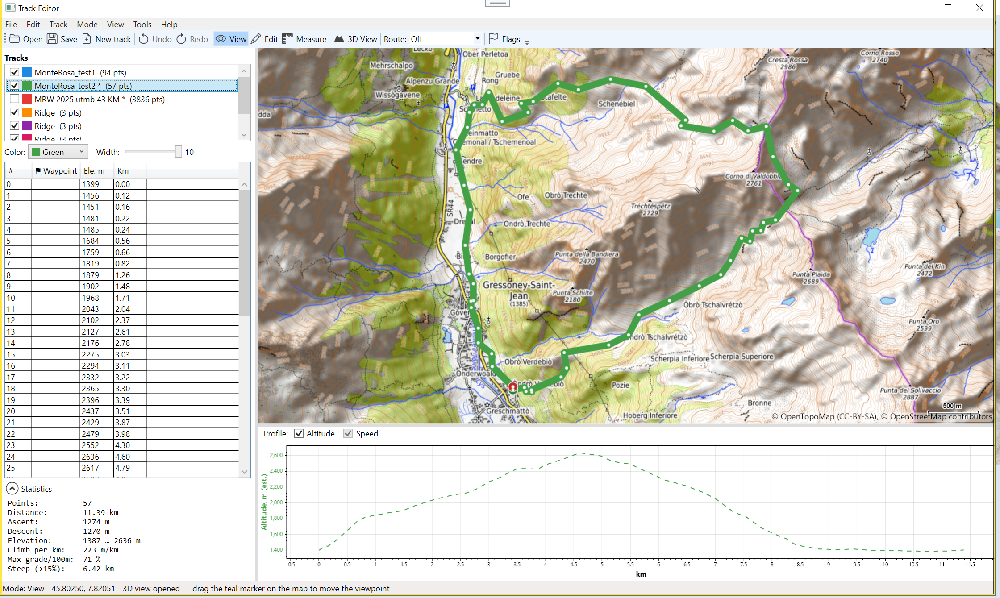

# TrackEditor

A Windows desktop app for viewing and editing GPS tracks — GPX, KML and KMZ —
on an interactive map, with an elevation/speed profile, real-path auto-routing,
and a 3D terrain view. Built with WPF (.NET 9), Mapsui, ScottPlot and HelixToolkit.



This document is also the in-app **Help ▸ User Guide** (press **F1**).

---

## Getting started

- **Open a track:** File ▸ Open (or the Open button, or Ctrl+O), and pick one or
  more `.gpx`, `.kml` or `.kmz` files. You can also drag files onto the app, or
  pass file paths on the command line.
- The map fits to the loaded tracks, the points appear in the list on the left,
  and the elevation/speed profile is drawn below the map.
- Your open tracks are remembered between runs and restored automatically.

---

## The window

- **Menu bar** — every command lives here, grouped as File, Edit, Track, Mode,
  View, Tools and Help. Commands that can't do anything right now are greyed out.
- **Toolbar** — quick access to the common actions: Open, Save, New track, Undo,
  Redo, the three modes (View / Edit / Measure), 3D View, the **Route** dropdown
  (auto-routing) and the Flags toggle.
- **Left panel** — the track list, the active track's colour/width, the points
  list, and the Statistics / Selection statistics / Measurement panels.
- **Map** — the interactive 2D map with your tracks drawn on top.
- **Profile** — altitude and speed against distance, below the map.
- **Status bar** — current mode, the cursor's coordinates, and the last action.

---

## Working with tracks

- **Open** adds tracks to whatever is already loaded; it never replaces them.
- **Save Active Track** (Ctrl+S) writes the active track to a GPX file.
  **Save All Tracks** writes every loaded track into one GPX.
- The **track list** shows every track with a checkbox (show/hide), a colour
  swatch and its name. **Right-click a row** anywhere along it for: Rename,
  Track Information, Save as GPX, Reverse, Simplify, Re-evaluate Elevation,
  Zoom to Track, and Remove from List.
- The **active track** is the one you're editing; its vertices and profile are
  shown. Click a track's line on the map (in View mode) to make it active, or
  pick it in the list.
- **Colour** and **Width** under the list restyle the active track.

---

## Modes

Switch modes on the toolbar, the Mode menu, or the map's right-click menu.

### View

- **Click a point** to select it. **Ctrl+click** toggles a point in the
  selection; **Shift+click** extends a range from the last selection.
- **Click a track's line** (not on a point) to make that track active.
- **Double-click** the map or the profile to centre the nearest point without
  changing zoom. Double-clicking a point in the list does the same.

### Edit (draw / move / insert)

- **Add points:** click on the map to append a point to the end of the active
  track. Appending only happens when the end of the track is the insertion point
  — i.e. nothing is selected, or the **last** point is selected. If you have a
  mid-track point selected, use double-click to insert instead.
- **Move a point:** drag any vertex. The line follows live; releasing commits
  the move as a single undo step.
- **Insert a point:** double-click on the map to insert a new point directly
  **after the selected point** (the new point becomes selected, so repeated
  double-clicks keep inserting in sequence).
- **Remove the last point:** right-click the map.
- **Auto-route:** see below.

### Measure

- Click any number of points on the map to measure a path. The panel reports the
  **path length**, the straight-line distance between the first and last points,
  the bearing, and — if an elevation source is available — the ascent/descent
  and average incline along the path.
- **Reset** a measurement by clicking the Measure button again, or "Reset
  Measurement" in the map's right-click menu.

---

## Auto-routing (drawing along real paths)

The toolbar **Route** dropdown controls how new points are connected while you draw:

- **Off** — new points are joined with straight segments.
- A **profile** (trekking, hiking-beta, fastbike, shortest, car-fast) — each new
  point is joined to the previous one by a real route that follows trails and
  roads, using the public **BRouter** service (brouter.de, no API key needed).
  The routed geometry carries elevation, which is added to your track.

Routes come back very densely sampled, so **Settings ▸ Auto-route** offers
"Simplify routed legs" (on by default) with a tolerance in metres (default 10) —
this thins each routed leg while keeping its shape and its endpoints. If a route
can't be found (offline, or no path exists), the new point is joined with a
straight segment instead.

---

## The points list

- Columns: index (always shown), plus optional Waypoint, Lat, Lon, Elevation,
  Time and distance-from-start (Km). Choose which columns to show in
  **Settings ▸ Points list columns**.
- Selecting rows here mirrors the selection on the map and the profile, and vice
  versa. The selection stays highlighted even when the grid isn't focused.
- **Right-click** for point operations: Copy, Paste (after the selected point),
  Delete, Split at the selected point, Crop to the selected range, Set/Remove
  Waypoint, and Center Point in Map.

### Waypoints

A waypoint is simply a **named** point that marks a key spot on the route. Set
one with "Set Waypoint Name…" in the points-list menu. Waypoints are drawn as a
diamond on the map, a dashed labelled line on the profile, and a highlighted row
in the list, and they round-trip through GPX (`<name>`/`<sym>` on the point).
Change the label colours in **Settings ▸ Waypoint labels**.

---

## Track operations

Available from the Track menu and the points-list / track-list menus:

- **Split at Selected Point** — break the active track into two at a point.
- **Crop to Selected Range** — keep only the selected span.
- **Delete Selected Points / Delete Selected Range / Delete Last Point.**
- **Simplify** — Douglas–Peucker reduction at a tolerance you enter (metres),
  preserving elevation and time on the points it keeps.
- **Reverse** — flip the track's direction.
- **Join Tracks** — combine two tracks into a new third one. Select the first
  track, choose **Track ▸ Join Tracks…** (or **Join Tracks…** on the track's
  right-click menu), then pick the second track in the list. The new track holds
  the first track's points followed by the second's and takes its colour and
  width; both originals are left untouched. While a join is waiting for its
  second track the other menu commands are greyed out and the command reads
  **Cancel Join** — press **Esc**, or choose it again, to back out.
- **Copy / Paste** points (Ctrl+C / Ctrl+V); paste inserts after the selection.
- **Undo / Redo** (Ctrl+Z / Ctrl+Y) — whole-document history covering every edit.

---

## Elevation

TrackEditor can fill in elevation for points that don't have it, from two sources
configured in **Settings ▸ Elevation sources**:

- **SRTM `.hgt` tiles** — offline elevation from local tiles in a folder you
  choose. Missing tiles can be **auto-downloaded** from the open
  elevation-tiles-prod dataset (each 1°×1° tile is ~25 MB).
- **Online service** — OpenTopoData or Open-Elevation, used as a fallback for
  points SRTM can't provide. Public services are rate-limited.

"Apply Elevation to Track" (Track menu) or "Re-evaluate Elevation" (track menu)
fills the active track. Estimated elevation is drawn as a **dashed** line on the
profile to distinguish it from recorded values.

The **profile** shows Altitude (left axis) and Speed (right axis). The Altitude
toggle is disabled when the track has no elevation; the Speed toggle is disabled
when the track has no timestamps (speed is derived from time + distance).

---

## Mileage flags

Toggle **Flags** to place distance/time labels along the active track at regular,
non-overlapping intervals. Choose what the labels show — Distance, Time, or both
— under View ▸ Mileage Flag Content.

---

## 3D terrain view

Open it from the **3D View** toolbar button or File ▸ 3D View. It builds a 3D
terrain surface for the region currently shown on the 2D map, from SRTM
elevation, and drapes the current map over it. Each basemap tile is draped
individually over its own patch of terrain, with your tracks drawn into the
tiles, so the route always lies on the surface and detail is limited by how many
tiles cover the area rather than by any single texture's size.


- **Mouse:** left-drag pans, right-drag rotates and tilts, the wheel zooms.
- **On-screen controls:** a movement cross (pan across the ground plus up/down),
  Rotate / Tilt / Zoom buttons, a reset-view button, and a vertical-exaggeration
  slider to accentuate relief.
- **Detail:** a **Detail** dropdown re-drapes the terrain with finer or coarser
  basemap tiles over the same region — independent of the 2D map's zoom, so you
  can add map detail (or simplify it) in 3D without changing the area shown.
  Levels needing many tiles are marked ⚠ (slower to build); levels beyond the
  limit for the area are listed but can't be picked.
- **Save image:** the **💾 Save** button next to the exaggeration slider writes
  the current 3D view to a PNG — exactly what you see, at the current camera
  angle and exaggeration, without the on-screen controls.
- **Compass:** a needle and numeric heading show the view direction.
- **Viewpoint marker:** a teal marker on the 2D map shows where the 3D camera
  stands and which way it looks — drag it to move the 3D viewpoint.

3D terrain needs SRTM elevation; with no SRTM folder configured the surface is
flat and the status line says so. The covering SRTM tiles are downloaded first
if auto-download is on.

---

## Exporting a map image

File ▸ Export Map Image renders the current map region — basemap tiles plus your
tracks — to a PNG at a chosen level of detail (shown as a map scale), with a
scale bar.


---

## Settings

**Tools ▸ Settings** covers:

- **Base map** — provider (OpenStreetMap, OpenTopoMap, CyclOSM, Esri World
  Imagery, Carto Light), a per-map tile-cache size limit in MB, and a
  "Clear tile cache" button.
- **Waypoint labels** — background and text colours for waypoint labels on the
  map and profile.
- **Points list columns** — which optional columns the list shows.
- **Auto-route** — simplify routed legs and the tolerance. (The on/off switch and
  routing profile are on the toolbar Route dropdown.)
- **Elevation sources** — SRTM folder and auto-download, and the online provider.

---

## Keyboard shortcuts

- **Ctrl+O** — Open files
- **Ctrl+S** — Save active track
- **Ctrl+Z / Ctrl+Y** — Undo / Redo
- **Ctrl+C / Ctrl+V** — Copy / Paste points
- **Del** — Delete selected points
- **Esc** — Cancel a pending Join
- **F1** — This user guide
- **Ctrl+click / Shift+click** — toggle / extend the selection. Shift extends
  from the point you last clicked, so a range can be built and re-extended in
  either direction.

---

## Data, network and privacy

- Everything runs locally. The app reaches the network only for **map tiles**,
  **auto-routing** (BRouter), **online elevation**, and **SRTM tile download** —
  and only when you use those features. Map tiles are cached on disk per base map.
- No account, sign-in or API key is required for any feature.

---

## Building from source

Requirements: the **.NET 9 SDK** on Windows.

```
dotnet build TrackEditor/TrackEditor.csproj
dotnet run   --project TrackEditor/TrackEditor.csproj
```

The solution (`TrackEditor.slnx`) also contains **TrackEditor.Core** (the shared,
UI-agnostic track/IO/geometry/elevation/routing code), **TrackEditor.Core.Skia**
(SkiaSharp map-image export) and **TrackEditor.ParseTest** (a headless
parse/statistics sanity check).

---

## Credits and licences

- Map data © **OpenStreetMap** contributors and the respective tile providers
  (OpenTopoMap, CyclOSM, Esri, CARTO).
- Routing by **BRouter** (brouter.de). Elevation from **SRTM** / the
  elevation-tiles-prod dataset, **OpenTopoData** and **Open-Elevation**.
- Built with **Mapsui**, **ScottPlot**, **HelixToolkit**, **SkiaSharp** and
  **SharpKml** — see each library for its licence. Toolbar icons are
  **Bootstrap Icons** (MIT).
