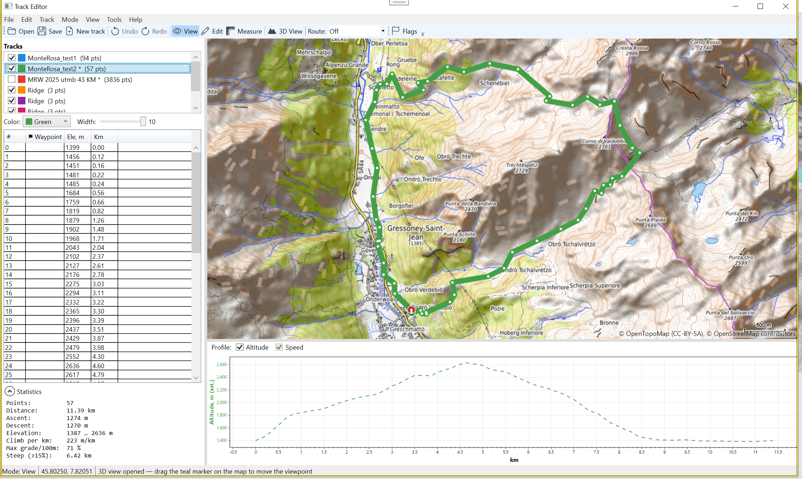

# TrackEditor

A Windows desktop app for viewing and editing GPS tracks — GPX, KML and KMZ —
on an interactive map, with an elevation/speed profile, real-path auto-routing,
a 3D terrain view, and **race-pace analysis** that learns your speed-vs-terrain
from recorded runs and predicts it on any route. Built with WPF (.NET 9),
Mapsui, ScottPlot and HelixToolkit.



This document is also the in-app **Help ▸ User Guide** (press **F1**).

---

## Getting started

- **Open a track:** File ▸ Open (or the Open button, or Ctrl+O), and pick one or
  more `.gpx`, `.kml` or `.kmz` files. You can also drag files onto the app.
- **Open from the web:** File ▸ Open from URL takes the address of a `.gpx`,
  `.kml` or `.kmz` file and downloads it. The format is read from the address
  where it ends in a known extension, and otherwise worked out from the file
  itself, so links ending in a query string or an id still work. A downloaded
  track has no file on disk, so **Save** asks where to put it.
- **From the command line:** pass file paths, web addresses, or both —
  `TrackEditor.exe hike.gpx https://example.com/route.gpx`
- The map fits to the loaded tracks, the points appear in the list on the left,
  and the elevation/speed profile is drawn below the map.
- Your open tracks are remembered between runs and restored automatically.

---

## The window

- **Menu bar** — every command lives here, grouped as File, Edit, Track, Mode,
  View, Race, Tools and Help. Commands that can't do anything right now are greyed out.
- **Toolbar** — quick access to the common actions: Open, Save, New track, Undo,
  Redo, the three modes (View / Edit / Measure), 3D View, the **Map** and **Route**
  dropdowns, the **Gradient** dropdown (colour the active track by speed / grade /
  pavement — see below) and the Flags toggle.
- **Left panel** — a **Tracks / Points tab strip** (only one list is shown at a
  time, so each gets the full panel height): the **Tracks** tab holds the track
  list plus the active track's colour/width; the **Points** tab holds the points
  list. Below the tabs sit the Statistics / Selection statistics / Measurement panels.
- **Map** — the interactive 2D map with your tracks drawn on top.
- **Profile** — altitude and speed against distance, below the map.
- **Status bar** — current mode, the cursor's coordinates, and the last action.

---

## Working with tracks

- **Open** adds tracks to whatever is already loaded; it never replaces them.
- **Save Active Track** (Ctrl+S) writes the active track to a GPX file.
  **Save All Tracks** writes every loaded track into one GPX.
- The **track list** shows every track with a checkbox (show/hide), a colour
  swatch and its name. **Right-click a row** anywhere along it for: Rename,
  Track Information, Save as GPX, Reverse, Join Tracks, Merge Tracks, Simplify,
  Re-evaluate Elevation, Evaluate Surface, Apply Race Model, Zoom to Track, and
  Remove from List.
- **Hover a track row** for its **classification** — terrain (Flat / Rolling /
  Hilly / Mountainous, plus a Road / Trail surface tag), the dominant load
  (Speed / Endurance / Climbing / Mixed), and an estimated effort in kcal — with
  the key numbers (distance, ascent/descent, time, speed). See *Track
  classification* below.
- The **active track** is the one you're editing; its vertices and profile are
  shown. Click a track's line on the map (in View mode) to make it active, or
  pick it in the list.
- **Colour** and **Width** under the list restyle the active track.

---

## Modes

Switch modes on the toolbar, the Mode menu, or the map's right-click menu.

### View

- **Click a point** to select it. **Ctrl+click** toggles a point in the
  selection; **Shift+click** extends a range from the last selection.
- **Click a track's line** (not on a point) to make that track active.
- **Double-click** the map or the profile to centre the nearest point without
  changing zoom. Double-clicking a point in the list does the same.

### Edit (draw / move / insert)

- **Add points:** click on the map to append a point to the end of the active
  track. Appending only happens when the end of the track is the insertion point
  — i.e. nothing is selected, or the **last** point is selected. If you have a
  mid-track point selected, use double-click to insert instead.
- **Move a point:** drag any vertex. The line follows live; releasing commits
  the move as a single undo step.
- **Insert a point:** double-click on the map to insert a new point directly
  **after the selected point** (the new point becomes selected, so repeated
  double-clicks keep inserting in sequence).
- **Remove the last point:** right-click the map.
- **Auto-route:** see below.

### Measure

- Click any number of points on the map to measure a path. The panel reports the
  **path length**, the straight-line distance between the first and last points,
  the bearing, and — if an elevation source is available — the ascent/descent
  and average incline along the path.
- **Reset** a measurement by clicking the Measure button again, or "Reset
  Measurement" in the map's right-click menu.

---

## Auto-routing (drawing along real paths)

The toolbar **Route** dropdown controls how new points are connected while you draw:

- **Off** — new points are joined with straight segments.
- A **profile** (trekking, hiking-beta, fastbike, shortest, car-fast) — each new
  point is joined to the previous one by a real route that follows trails and
  roads, using the public **BRouter** service (brouter.de, no API key needed).
  The routed geometry carries elevation, which is added to your track.

Routes come back very densely sampled, so **Settings ▸ Auto-route** offers
"Simplify routed legs" (on by default) with a tolerance in metres (default 10) —
this thins each routed leg while keeping its shape and its endpoints. If a route
can't be found (offline, or no path exists), the new point is joined with a
straight segment instead.

---

## Gradient colouring

The toolbar **Gradient** dropdown draws the **active** track with a red → blue
gradient along its segments, so you can read a metric straight off the line —
**red = fast / easy, blue = slow / hard**. Every other track keeps its own solid
colour, and picking a different track in the list moves the gradient to it.
A small legend in the map's bottom-left corner shows the metric and the value at
each end of the ramp.

- **Off** — the active track uses its own colour (the default).
- **Speed** — needs timestamps; red is the fastest stretch, blue the slowest
  (the ramp is normalised to the track's own 5th–95th-percentile speeds, so a
  single GPS spike doesn't wash it out). In pace mode the legend labels show
  min/km instead of km/h.
- **Inclination** — needs elevation; the per-segment grade, with **descending**
  at the red end and **climbing** at the blue end.
- **Pavement** — the per-segment surface passability from the point's Surface tag
  (fill it with Race ▸ Evaluate Surface). Segments with no surface information are
  treated as **unpaved**.

The choice persists between sessions, and the gradient carries through to the
**PNG map export** and the **3D terrain view** (both draw the selected track with
the same red→blue runs). There's a matching note under
**Settings ▸ Gradient colouring**.

---

## The points list

- Columns: index (always shown), plus optional Waypoint, Lat, Lon, Elevation,
  Time and distance-from-start (Km), and — when the track carries them — heart
  rate (HR), cadence (Cad), temperature (°C) and Surface. Choose which columns to
  show in **Settings ▸ Points list columns**.
- **HR, cadence and temperature** are read from GPX `<extensions>` (Garmin or
  Strava namespaces) and round-trip on save. **Surface** is an OSM ground type
  filled by Race ▸ Evaluate Surface (see below); it also round-trips through GPX.
- Selecting rows here mirrors the selection on the map and the profile, and vice
  versa. The selection stays highlighted even when the grid isn't focused.
- **Right-click** for point operations: Copy, Paste (after the selected point),
  Delete, Split at the selected point, Crop to the selected range, Set/Remove
  Waypoint, and Center Point in Map.

### Waypoints

A waypoint is simply a **named** point that marks a key spot on the route. Set
one with "Set Waypoint Name…" in the points-list menu. Waypoints are drawn as a
diamond on the map, a dashed labelled line on the profile, and a highlighted row
in the list, and they round-trip through GPX (`<name>`/`<sym>` on the point).
Change the label colours in **Settings ▸ Waypoint labels**.

---

## Track operations

Available from the Track menu and the points-list / track-list menus:

- **Split at Selected Point** — break the active track into two at a point.
- **Crop to Selected Range** — keep only the selected span.
- **Delete Selected Points / Delete Selected Range / Delete Last Point.**
- **Simplify** — Douglas–Peucker reduction at a tolerance you enter (metres),
  preserving elevation and time on the points it keeps.
- **Reverse** — flip the track's direction.
- **Join Tracks** — combine two tracks into a new third one. Select the first
  track, choose **Track ▸ Join Tracks…** (or **Join Tracks…** on the track's
  right-click menu), then pick the second track in the list. The new track holds
  the first track's points followed by the second's and takes its colour and
  width; both originals are left untouched. While a join is waiting for its
  second track the other menu commands are greyed out and the command reads
  **Cancel Join** — press **Esc**, or choose it again, to back out.
- **Merge Tracks** — fuse a **second recording of the same route** into the active
  track, adding the result as a new track (both originals kept). Available from
  **Track ▸ Merge Tracks…** or **Merge Tracks…** on the track's right-click menu.
  The two are matched point-for-point — by **timestamp** when both are timed and
  their clocks overlap, otherwise by **distance** — within a proximity gate, so
  unrelated tracks match nothing and are left alone. The merged track gains the
  channels the base lacks (HR, cadence, temperature, surface, elevation); the
  geometry either keeps the base line or averages the two where they overlap, and
  the dialog reports the overlap coverage and mean separation before you add it.
- **Copy / Paste** points (Ctrl+C / Ctrl+V); paste inserts after the selection.
- **Undo / Redo** (Ctrl+Z / Ctrl+Y) — whole-document history covering every edit.

### Merge Tracks — fusing two recordings of one route

Two GPS logs of the same route (a watch and a phone, or two runners) rarely line
up sample-for-sample. Merge walks the **base** track (the active one) and, for
each of its points, finds the matching moment on the second track, then fills in
or averages the data there. The base is never changed — a **new** track named
`"<base> + <second>"` is added, so you can discard it and try again freely.

The dialog (**Track ▸ Merge Tracks…**, or **Merge Tracks…** on a track's
right-click menu) exposes:

- **Merge with** — the second recording to pull from.
- **Align points by** — how base points are paired with the other track:
  - **Auto** — by timestamp when both tracks are timed and their clocks overlap,
    otherwise by distance.
  - **Timestamp** — pair by real (UTC) time; the second track is interpolated to
    each base point's exact moment. Correct when both devices logged the same session.
  - **Distance** — pair each base point with the nearest point on the second
    track's line. For logs that share no clock.
- **Geometry** — what coordinates the result carries:
  - **Keep base line** (default) — base coordinates untouched; only the second
    track's extra channels are pulled in.
  - **Average both lines** — matched pairs move to their midpoint to cancel some
    GPS wander; stretches with no partner keep the base coordinates, so a partial
    overlap still survives.
- **Match gate (m)** — a base point whose partner is farther than this (default
  **60 m**) is treated as unmatched: no fusion and no averaging there. This gate
  is what stops two genuinely different routes from being welded together.
- **Keep base value when both have a field** — when both tracks carry the same
  channel at a matched point, keep the base's value instead of averaging the two.

Channels the base **lacks** are always filled from the second track — **HR,
cadence, temperature, elevation, surface and time** can each be gained this way.
Before you commit, the dialog's report shows how it aligned (timestamp/distance),
matched points and percentage overlap, the mean separation between the two lines,
and which channels were gained — or warns when nothing matched within the gate
(a sign the two tracks aren't the same route). Press **Add Merged Track** to keep it.

---

## Elevation

TrackEditor can fill in elevation for points that don't have it, from two sources
configured in **Settings ▸ Elevation sources**:

- **SRTM `.hgt` tiles** — offline elevation from local tiles in a folder you
  choose. Missing tiles can be **auto-downloaded** from the open
  elevation-tiles-prod dataset (each 1°×1° tile is ~25 MB).
- **Online service** — OpenTopoData or Open-Elevation, used as a fallback for
  points SRTM can't provide. Public services are rate-limited.

"Apply Elevation to Track" (Track menu) or "Re-evaluate Elevation" (track menu)
fills the active track. Estimated elevation is drawn as a **dashed** line on the
profile to distinguish it from recorded values.

The **profile** shows Altitude (left axis) and Speed (right axis), plus optional
**HR**, **Cadence** and **Temp** series — each on its own axis, toggled by the
checkboxes above the plot and enabled only when the track carries that channel.
The Altitude toggle is disabled when the track has no elevation; the Speed toggle
is disabled when the track has no timestamps (speed is derived from time +
distance). Selecting several points shades that **distance range** on the profile
as well as marking the current point.

---

## Mileage flags

Toggle **Flags** to place distance/time labels along the active track at regular,
non-overlapping intervals. Choose what the labels show — Distance, Time, or both
— under View ▸ Mileage Flag Content.

---

## Race analysis

Learn how you move over terrain from your recorded runs, then predict your pace
on any planned route. Everything is on the **Race** menu.

- **Analyze Race Ability…** — pick one or more recorded (timestamped) tracks and
  fit a *race model*: your speed as a function of slope, how you fade with
  accumulated climb (**fatigue**), and how much course twistiness (**turns**)
  slows you. A checklist confirms which signals to use — heart rate calibrates
  fatigue when present; each track is normalized to its own pace before pooling.
  **Export Model** saves the result to a `*.racemodel.json` file.
- **Apply Race Model…** — load a saved model and apply it to the active track to
  predict the race. It creates a timestamped copy named "<name> (predicted)" and
  reports the finish time, moving pace and per-waypoint ETAs. Set the **start
  time** (default 08:00), a **surface / conditions** multiplier, and optionally
  the altitude derate. If the target has no elevation you're warned to apply
  elevation first, since every grade would otherwise read as flat. Also on a
  track's right-click menu as **Apply Race Model…**.
  - **Create Profile…** (next to Import Model) fits a model right here from your
    recorded tracks, seeded with this target: recorded tracks are rated by how
    similar they are to the target (a **green / yellow / red** dot — terrain,
    load, distance), and the close matches are pre-ticked so the fit uses
    like-for-like efforts. Tracks with no timestamps (unusable) and the target
    itself are hidden. The fitted model is handed straight back to Predict — no
    export/import round-trip.
- **Evaluate Surface (routing)…** — fill each point's surface **type** from OSM by
  auto-routing along the track (BRouter) and adopting the way's surface — but only
  where the route actually hugs your track (within a proximity gate). Off-route or
  untagged stretches are left blank rather than guessed; the status line reports
  the coverage. Results show in the points list's Surface column and feed surface
  into predictions. Also available on a track's right-click menu.

The model is deliberately **separable and human-readable** — a base
speed-by-grade curve, a fatigue decay, a turn penalty and a surface multiplier
that each fit and apply independently — so the exported JSON can be inspected and
edited by hand.

### Inside the race model

The fitted model (`*.racemodel.json`) is a product of independent factors —
`speed = baseCurve(grade) × fatigue(effort) × turns × altitude × surface` — each
stored plainly so it can be read and hand-tuned:

- **Base curve** — your fresh speed as a function of signed **grade**, sampled on
  a ~1° grid (roughly −25°…+25°). This is the backbone; every other factor scales it.
- **Fatigue** — a multiplier that decays as effort piles up. The **driver**
  (cumulative ascent, elapsed time, or distance), the **shape** (linear or
  exponential) and the decay rate are fitted, with a floor so a long effort never
  predicts an absurd crawl. When HR is present its upward **drift** (aerobic
  decoupling) is measured and used to steepen fatigue for harder-than-fitted efforts.
- **Turns** — a mild multiplier for course twistiness (turn density, deg/m),
  neutral at the course's average; tighter sections derate, straighter ones get a
  small boost (turns never speed you up beyond that).
- **Altitude** — a physiological derate above a reference elevation. The fit
  leaves it at zero (the recording already saw whatever altitude it saw); the
  predictor switches it on only when you model a course higher than the fit
  (~4 % of speed per 1000 m by default).
- **Athlete baseline** — the flat-ground speed each source track was normalized to
  before pooling (plus a reference HR), so recordings run at different paces
  combine without the fastest one dominating.

**Analyze Race Ability** normalizes every chosen track to its own pace, pools the
segments and fits the factors above; the checklist decides which signals to trust
(HR calibrates fatigue when present). **Apply Race Model** resamples the target to
the same grade grid and integrates it segment by segment into a timed copy,
honouring the **start time**, a **surface / conditions** multiplier (plus any
routing-inferred per-point surface), and the optional **altitude** derate — then
reports the finish time, moving pace and per-waypoint ETAs.

---

## Track classification

Hovering a track in the list shows a quick, **athlete-independent** read of what
the track is — computed from its own geometry, time and surface, so two tracks
compare on the same footing:

- **Terrain** — Flat / Rolling / Hilly / Mountainous from the hilliness index
  (ascent + descent per km), plus a **Road / Trail / Mixed** tag when the track
  carries OSM surface data.
- **Load** — the dominant demand: **Speed** (short and quick), **Endurance**
  (long or long-lasting), **Climbing** (lots of vertical), or **Mixed**.
- **Effort** — an estimated energy cost in **kcal** (level work plus the work of
  the total climb, at a fixed 70 kg reference mass) and a rough **Easy /
  Moderate / Hard** intensity from kcal per hour when the track is timed.

The same classification drives **Create Profile** (see *Race analysis*), which
rates recorded tracks by how similar they are to a prediction target. The
thresholds are transparent heuristics, meant as a fast label rather than a lab
measurement.

## 3D terrain view

Open it from the **3D View** toolbar button or File ▸ 3D View. It builds a 3D
terrain surface for the region currently shown on the 2D map, from SRTM
elevation, and drapes the current map over it. Each basemap tile is draped
individually over its own patch of terrain, with your tracks drawn into the
tiles, so the route always lies on the surface and detail is limited by how many
tiles cover the area rather than by any single texture's size.


- **Mouse:** left-drag pans, right-drag rotates and tilts, the wheel zooms.
- **On-screen controls:** a movement cross (pan across the ground plus up/down),
  Rotate / Tilt / Zoom buttons, a reset-view button, and a vertical-exaggeration
  slider to accentuate relief.
- **Detail:** a **Detail** dropdown re-drapes the terrain with finer or coarser
  basemap tiles over the same region — independent of the 2D map's zoom, so you
  can add map detail (or simplify it) in 3D without changing the area shown.
  Levels needing many tiles are marked ⚠ (slower to build); levels beyond the
  limit for the area are listed but can't be picked.
- **Flags:** label flags that always face you as you orbit and stay visible
  through the terrain, so you never lose one behind a hill. **Waypoints** (a
  checkbox, on by default) plants a named flag at each waypoint; **Track pts** (a
  dropdown) drops distance flags along the active track at a chosen spacing —
  Off, or 50 m up to 10 km — always including the finish. Both follow the vertical
  exaggeration and only cover the region currently in view.
- **Sun:** tick **☀ Sun** to light the terrain from the sun's real position
  instead of the flat default daylight. Slopes facing the sun brighten and those
  turned away fall into shade, and hills **cast real shadows** across the ground
  — computed by ray-marching the elevation grid toward the sun and baked into the
  drape, so a ridge shadows the valley behind it. The time is seeded from the
  selected track point (or the first timestamped point) and the slider moves the
  sun across that day (UTC); the label shows the time and the sun's altitude, or
  *below horizon* at night. Slope shading follows the slider live; the cast
  shadows re-bake a moment after you stop dragging (and after a change of vertical
  exaggeration, which they follow). The checkbox is disabled when no point in the
  loaded tracks carries a timestamp.

  *Note:* WPF's 3D pipeline has no GPU shadow mapping, so these are heightfield
  cast shadows computed on the terrain itself rather than shadow-mapped in the
  GPU — they shadow the ground (and anything draped on it), which is what a
  terrain view needs.
- **Save image:** the **💾 Save** button next to the exaggeration slider writes
  the current 3D view to a PNG — exactly what you see, at the current camera
  angle and exaggeration, without the on-screen controls.
- **Compass:** a needle and numeric heading show the view direction.
- **Viewpoint marker:** a teal marker on the 2D map shows where the 3D camera
  stands and which way it looks — drag it to move the 3D viewpoint.

3D terrain needs SRTM elevation; with no SRTM folder configured the surface is
flat and the status line says so. The covering SRTM tiles are downloaded first
if auto-download is on.

---

## Exporting a map image

File ▸ Export Map Image renders the current map region — basemap tiles plus your
tracks — to a PNG at a chosen level of detail (shown as a map scale), with a
scale bar.


---

## Settings

**Tools ▸ Settings** covers:

- **Base map** — the tile **provider** (OpenStreetMap, OpenTopoMap, CyclOSM, Esri
  World Imagery, Carto Light) used for the map and as the drape in 3D and in map
  exports. Each map keeps its own on-disk **tile-cache limit** (MB; `0` = no
  limit) and a **Clear tile cache** button drops the cached tiles for the selected map.
- **Waypoint labels** — the **background** and **text** colours used to draw
  waypoint labels on both the map and the profile; a live "Waypoint" swatch
  previews the pair.
- **Points list columns** — which optional columns the points list shows
  (Waypoint, Lat, Lon, Ele, Time, Km, HR, Cadence, Temperature, Surface). The
  index column is always shown, and a ticked column with no data on the active
  track hides itself automatically. Mirrors the **View ▸ Points List Columns** menu.
- **Statistics** — **Show speed as pace (min/km)** swaps every speed readout in
  the statistics and profile from km/h to running pace.
- **Gradient colouring** — a note only; the metric (Off / Speed / Inclination /
  Pavement) is chosen on the toolbar **Gradient** dropdown. See *Gradient
  colouring* above.
- **Auto-route** — **Simplify routed legs** and its **tolerance** in metres
  (larger = fewer points). The on/off switch and the routing profile itself live
  on the toolbar **Route** dropdown, not here.
- **Elevation sources** — the **SRTM `.hgt` folder** and whether missing tiles
  **auto-download**, plus the **online** provider used as a fallback. See
  *Elevation* above for how the two sources combine.

---

## Keyboard shortcuts

- **Ctrl+O** — Open files
- **Ctrl+S** — Save active track
- **Ctrl+Z / Ctrl+Y** — Undo / Redo
- **Ctrl+C / Ctrl+V** — Copy / Paste points
- **Del** — Delete selected points
- **Esc** — Cancel a pending Join
- **F1** — This user guide
- **Ctrl+click / Shift+click** — toggle / extend the selection. Shift extends
  from the point you last clicked, so a range can be built and re-extended in
  either direction.

---

## Data, network and privacy

- Everything runs locally. The app reaches the network only for **map tiles**,
  **auto-routing** (BRouter, also used by Evaluate Surface), **online elevation**,
  and **SRTM tile download** — and only when you use those features. Map tiles are
  cached on disk per base map. Race models are plain local `*.racemodel.json` files.
- No account, sign-in or API key is required for any feature.

---

## Building from source

Requirements: the **.NET 9 SDK** on Windows.

```
dotnet build TrackEditor/TrackEditor.csproj
dotnet run   --project TrackEditor/TrackEditor.csproj
```

The solution (`TrackEditor.slnx`) also contains **TrackEditor.Core** (the shared,
UI-agnostic track/IO/geometry/elevation/routing/race-analysis code), **TrackEditor.Core.Skia**
(SkiaSharp map-image export) and **TrackEditor.ParseTest** (a headless
parse/statistics sanity check).

---

## Credits and licences

- Map data © **OpenStreetMap** contributors and the respective tile providers
  (OpenTopoMap, CyclOSM, Esri, CARTO).
- Routing by **BRouter** (brouter.de). Elevation from **SRTM** / the
  elevation-tiles-prod dataset, **OpenTopoData** and **Open-Elevation**.
- Built with **Mapsui**, **ScottPlot**, **HelixToolkit**, **SkiaSharp** and
  **SharpKml** — see each library for its licence. Toolbar icons are
  **Bootstrap Icons** (MIT).
